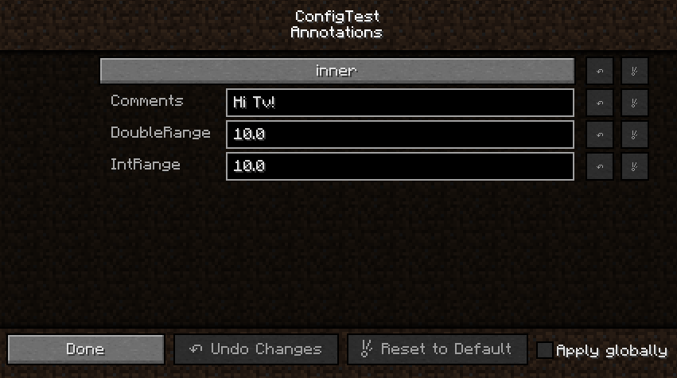
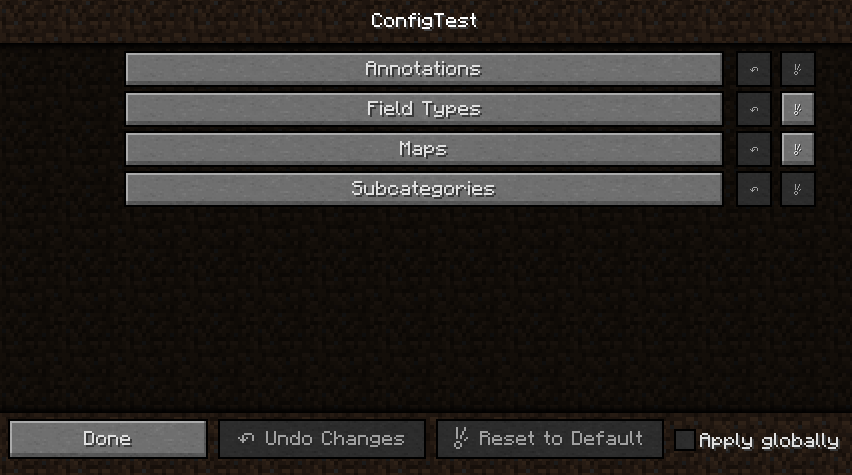

Configuration with @Config
==========================
Instead of manualy working with `Configuration` objects, you can describe your configuration file  
with the `@Config` annotation. 

If Forge finds a class annotated with `@Config`, it will create a configuration file for it and syncronize  
its content with the fields in the class. You can (or must) specify the following properties in `@Config`:
* modid: You need to specify your mods modid
* name: The name of the configuration file. By default, this is the modid.
* type: Currently unused, it works if it's not specified
* category: The config category in which you want your properties to be safed.

Let's say your mods id is "modid". A valid example would be the following:

````java
@Config(modid = "modid")
public class MyConfig {

}
````

Properties
----------
To create a property in your configuration, you simply specify a field within your class:

````java
public static String greetingMessage = "Hello World!";
````

This creates a property with name "greetingMessage" and default value "Hello World!". Note that
the field has to be static if specified in the class annotated with `@Config`. This will be explained
in a section down bellow (see Advanced Configuration Classes).
The current value of your property will be written to the corresponding variable after syncronization.

There are various annotations to customize your properties.
To change the name of your property in the configuration file, there is the `@Name` annotation. It takes
only one value, the name, which then will be used in the configuration file instead of the fields name.

To change the language key (default: "modid.category.field", or "modid.field" if category is empty) use
`@LangKey`. It takes one value, the language key for translation.

For integer and double fields, there are the `@RangeInt` and `@RangeDouble` annotations. They take two values,
`min` and `max`. The field value is then checked to be within these values.

If the usage of your property is not clear only knowing its name, you can specify a (multiline) comment with
`@Comment`. It takes a String array, whose entries will be concatenated with new line characters.

Changes to your properties and/or entire categories may require a world restart or a game restart. You can
specify this with `@RequiresWorldRestart` and `@RequiresMcRestart`. If a user changes these properties, they
will be notified, that they need to either restart the world or restart Minecraft.

Example:
````java
@LangKey("example.key")
@Comment({"This is an example", "for a multiline comment"})
@RangeInt(min = -10, max = 10)
@RequiresWorldRestart
public static int example = 4;
````

Configuration GUIs
------------------
If you use the `@Config` annotation to create your configuration file, a configuration gui will be provided by default.
If you wish to disable this, you need to provide a custom `IModGuiFactory` in the `@Mod` annotation.

By default, if you have only one configuration class, you will be provided with a config gui containing all of them sorted
alphabeticaly.


If you have more than one configuration class, you will get an alphabetically sorted button list providing access to these
categories.
The buttons will be named according to your `@LangKey` annotations.



Advanced Configuration Classes
------------------------------
You can apply `@LangKey`, `@RequiresMcRestart` and `@RequiresWorldRestart` to your classes to provide custom language
keys and information regarding changes and required restarts.

If you whish to create a subcategory, you can create an object whose super class is `java.lang.Object`. In it, you can create non-static,
but public fields with the same annotations as above. If there is a field in your configuration class containing such an object,
it will be used as a subcategory, and the fields customizations will be applied to the subcategory. 

The following is an example copied from the ConfigTest testmod in forge:

````java
@LangKey("config_test.config.subcats")
@Config(modid = MODID, name = MODID + "_subcats", category = "")
public static class CONFIG_SUBCATS {
    @Name("test_a")
    public static SubCat sub1 = new SubCat("Hello");

    @Name("test_b")
    public static SubCat sub2 = new SubCat("Goodbye");

    public static class SubCat {
        @Name("i_say")
        public String value;
       
        public SubCat(String value) {
            this.value = value;
        }
    }
}
````

This will create two categories in this configuration file. "test_a" and "test_b". Each of them contain a seperate property called "i_say".